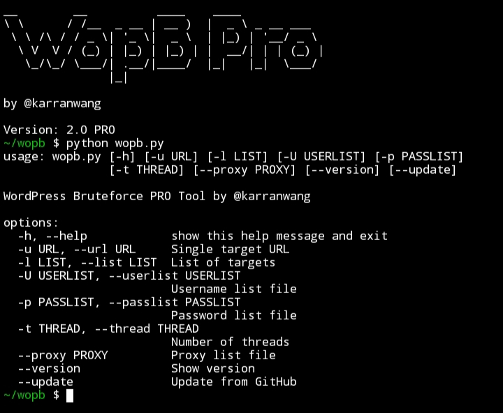

# WOPB PRO - WordPress Bruteforce Tool

**WOPB PRO** (WordPress Online Password Bruteforcer) adalah tool bruteforce WordPress berbasis Python dengan fitur lengkap:
- Single target & mass target support
- Random User-Agent & Proxy
- Progress bar `tqdm`
- Cek WordPress aktif atau tidak
- Auto resume wordlist jika error
- Save hasil valid login otomatis
- Auto update dari GitHub
- Anti bot basic protection

---

## Features
- [x] Single Target Bruteforce
- [x] Mass Target Bruteforce (multi-threading)
- [x] Random User-Agent
- [x] Proxy Support
- [x] Progress Bar (tqdm)
- [x] Check WordPress Active
- [x] Save result (vuln.txt, mass_vuln.txt)
- [x] Auto update from GitHub repo
- [x] Clean Exit & Error Handling

---

## Installation

1. Clone Repository:

   ```bash
   git clone https://github.com/karranwang/wopb
   ```
   
   ```bash
   cd wopb
   ```
   
2. Install dependencies

   ```bash
   pip install -r requirements.txt
   ```

## Usage

- [X] Single Target

   ```bash
   python wopb.py -u https://target.com/wp-login.php -U wordlists/userlist.txt -p wordlists/passlist.txt --proxy proxy.txt
   ```
- [X] Mass Target

   ```bash
   python wopb.py -l target.txt -U wordlists/userlist.txt -p wordlists/passlist.txt -t 5 --proxy proxy/proxy.txt
   ```

   -t = 5 (default thread) use from 1 - 10
   
   
- [X] Check Version

   ```bash
   python wopb.py --version
   ```
   
- [X] Update Tools

   ```bash
   python wopb.py --update
   ```
   
- [X] Help

   ```bash
   python wopb.py --help
   ```
   

## Example Output

[*] Starting single target brute...
Bruteforcing: 100%|████████████████████| 50000/50000 [01:23<00:00, 601/s]
[SUCCESS] https://target.com/wp-login.php => admin:password123
Saved to vuln/vuln.txt


## Author

by @karranwang


## Legal Disclaimer

This tool is for educational and authorized testing purposes only.
Using it against targets without permission is illegal!
